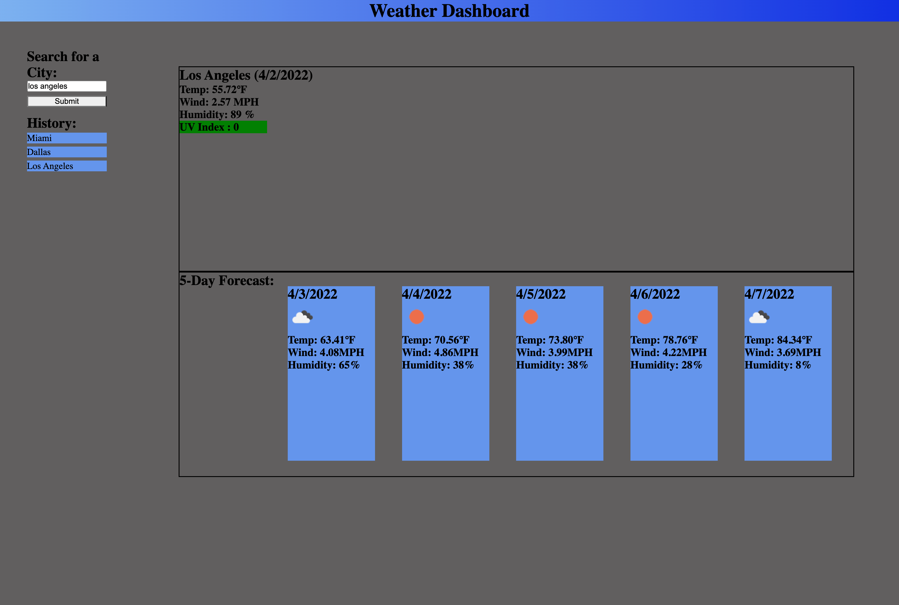

# Weather DashBoard
<h2>Link To Website</h2>

<a href= "https://brian-000.github.io/weather-dash/">https://brian-000.github.io/weather-dash/</a>

<h2>Description</h2>

 Weather Dashboard to check weather from any city in the world and a 5 day forecast

<h2>Screenshot of Website</h2>

